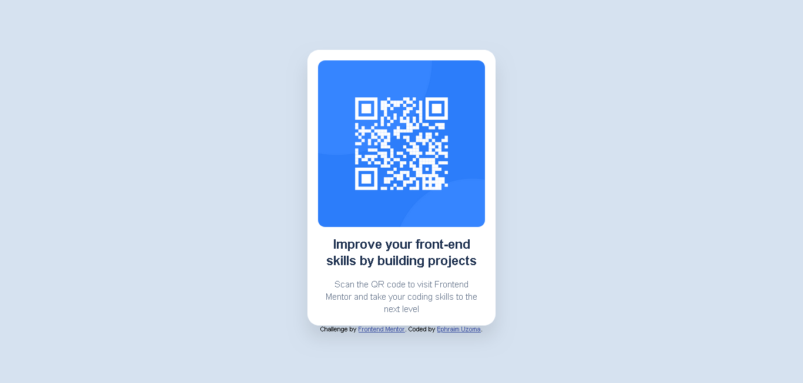

# Frontend Mentor - QR code component solution

This is a solution to the [QR code component challenge on Frontend Mentor](https://www.frontendmentor.io/challenges/qr-code-component-iux_sIO_H). Frontend Mentor challenges help you improve your coding skills by building realistic projects. 

## Table of contents

- [Overview](#overview)
  - [Screenshot](#screenshot)
  - [Links](#links)
  - [Built with](#built-with)
  - [What I learned](#what-i-learned)
  - [Continued development](#continued-development)
  - [Useful resources](#useful-resources)
- [Author](#author)

## Overview

### Screenshot

### Links

- Solution URL: [Add solution URL here](https://github.com/Ephyjack/Frontend_Projects/tree/main/Frontend_Mentor/QR_Code_component)
- Live Site URL: [Add live site URL here](https://your-live-site-url.com)

### Built with

- Semantic HTML5 markup
- CSS custom properties
- CSS Grid

### What I learned

I learnt how to use the css grid in the post customized way possible. For the
html code, div was the main element used, and it was the foundation of of this
project.

### Continued development

Areas that require the use of flexboxes, more grid, and div, most modern websites are made up of
these, bo i would love to become conversant with areas such as these.

### Useful resources

- [resource 1](www.w3schools.com) - This was my main resource for this project..

## Author

- Frontend Mentor - [@Ephyjack](https://www.frontendmentor.io/profile/Ephyjack)
- Twitter - [@frontendsprout
](https://www.twitter.com/@frontendsprout
)

